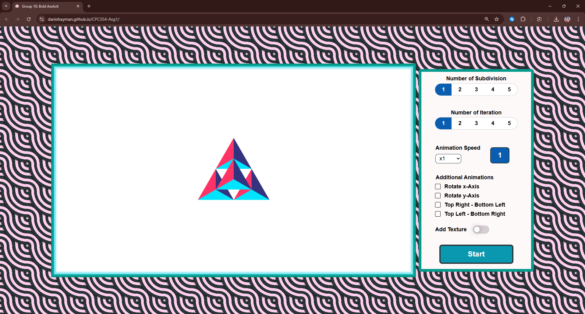

# 3D Sierpinski Gasket

This project is an interactive WebGL application that renders a 3D Sierpinski Gasket. It allows users to customize the gasket's appearance and animation through various controls.

[Try the Demo yourself here!](https://danishayman.github.io/3D-Sierpinski-Gasket/)

## Features

- **Subdivision:** Control the level of detail (subdivision) of the gasket.
- **Iterations:** Specify the number of animation iterations.
- **Animation:**  Animate the gasket with rotation, scaling, and movement.
- **Texture:** Apply a texture to the gasket.
- **Animation Speed:** Control the speed of the animation.
- **Interactive Controls:**  Start, stop, and reset the animation.

## How to Run

1. **Clone the repository:** `git clone https://github.com/danishayman/3D-Sierpinski-Gasket.git`
2. **Open `index.html` in a web browser.**

## Controls

- **Subdivision:** Use the slider or radio buttons to adjust the subdivision level.
- **Iterations:** Use the slider or radio buttons to set the number of animation iterations.
- **Animation:**
    - Click the "Start Animation" button to start the animation.
    - Click "Stop" to pause the animation.
    - Click "Reset" to reset the animation to the initial state.
- **Texture:** Use the checkbox to toggle the texture overlay.
- **Animation Speed:** Use the dropdown to select the animation speed.
- **Movement:** Use the checkboxes to enable/disable different movement animations.
- **Rotation:** Use the checkboxes to enable/disable rotation along the X and Y axes.

## Technologies Used

- **WebGL:**  For rendering the 3D graphics.
- **JavaScript:** For handling user interaction and animation logic.
- **HTML:** For structuring the web page.
- **CSS:** For styling the user interface.
- **GLSL (Vertex and Fragment Shaders):** For defining the graphics pipeline.

## Project Structure

- **`index.html`:**  The main HTML file.
- **`Asg1.js`:** The JavaScript file containing the WebGL and animation logic.
- **`style.css`:** The CSS file for styling the page.
- **`Common/`:** A directory containing external JavaScript libraries (webgl-utils.js, initShaders.js, MV.js).
- **`README.md`:** This file.

## Future Improvements

- **More animation options:** Add more animation types and customization.
- **User-defined textures:** Allow users to upload their own textures.
- **Lighting and shading:** Implement basic lighting and shading to enhance the 3D effect.
- **Code optimization:** Optimize the code for better performance, especially for mobile devices.

## Contributing

Contributions are welcome! Feel free to open issues or submit pull requests.
